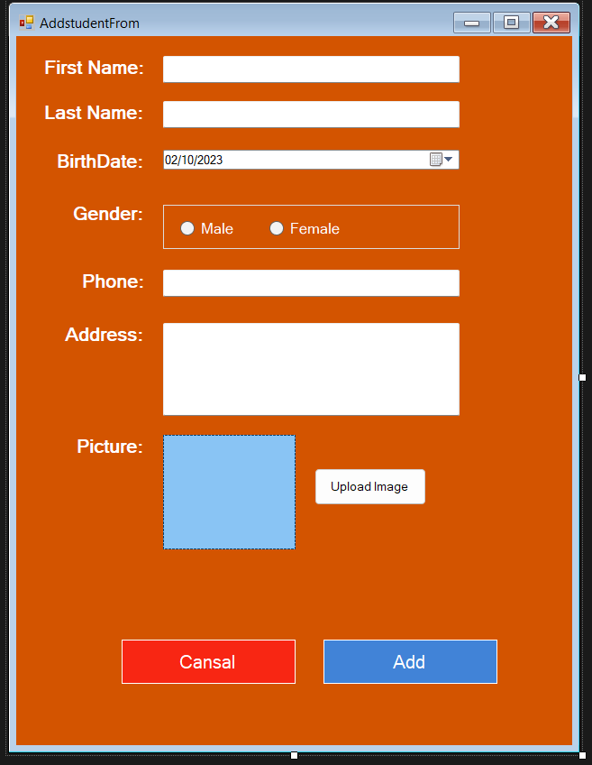
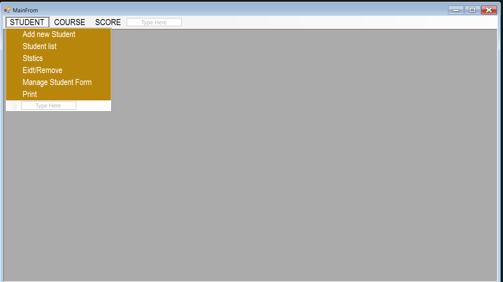
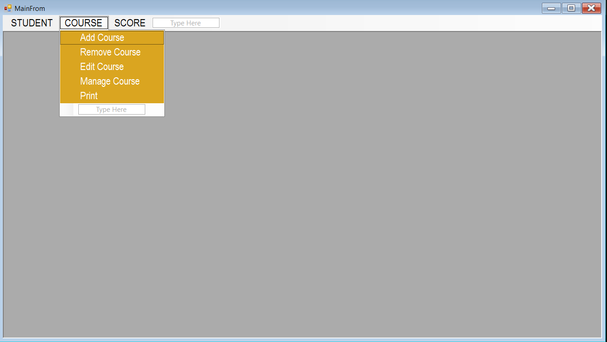
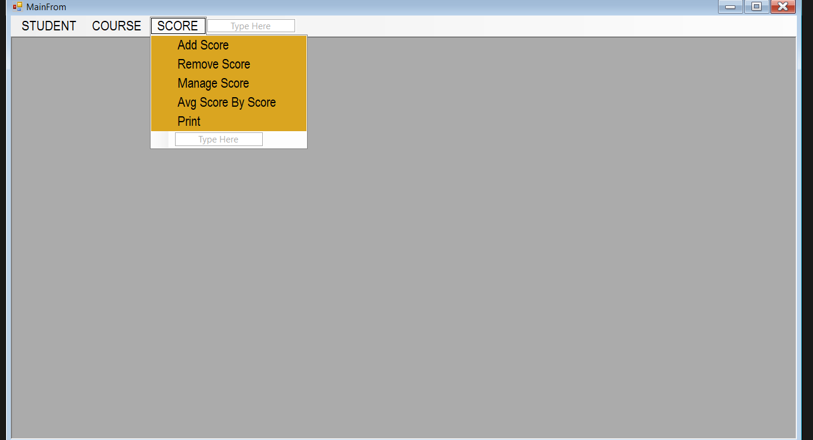

# Result Management System (C#)

## Overview

The Result Management System in C# is a user-friendly software application designed to streamline and automate the process of managing and recording academic results in educational institutions, such as schools, colleges, and universities. This system provides a comprehensive solution for administrators, teachers, and students to efficiently manage and access academic performance data.

## Features

### User Management

- **Admins**: Create and manage user accounts for teachers, students, and staff, ensuring secure access and data privacy.

### Course Management

- **Users**: Define and manage academic courses, including subject details, course codes, and schedules.

### Student Registration

- **System**: Facilitate the registration of students into specific courses, along with their personal and academic information.

### Result Entry

- **Teachers**: Easily enter and update students' exam scores, including grades and comments, for each subject and exam.

### Automated Calculation

- **System**: Automatically calculates aggregate scores, GPA, and class ranks based on predefined grading criteria.

### Report Generation

- **Generate**: Printable academic reports, such as transcripts, report cards, and progress reports, for students and parents.

## Getting Started

[Provide instructions on how to set up and run the Result Management System on your local machine.]

## Usage

[Include details on how to use the system, including any required commands or steps.]

## License

[Specify the license for the system, e.g., MIT License.]

## Contact

[Provide contact information for inquiries or support.]

---

Feel free to customize this README file further to match the specifics of your Result Management System and include any additional information that you find relevant.
